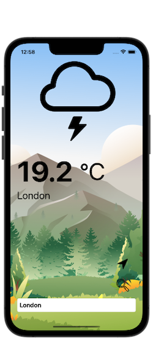
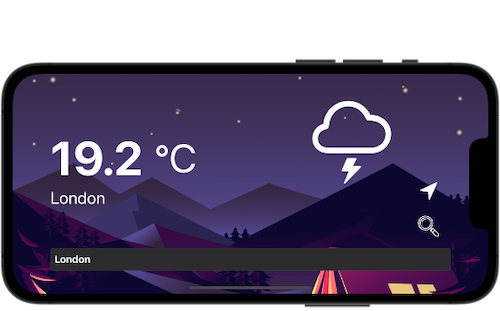

# SimpleWeather

## Introduction

You have probably seen a very similar project to SimpleWeather all over the internet. By building SimpleWeather I wanted to demonstrate what a clean code can look like. Usually, with small projects, developers don't worry too much about decoupling interfaces, hiding the details behind abstractions because the code base is small and easy to change. Adding more layers of abstractions to hide the details seems unnecessary and it might seem like an overkill. Following good practices come with many benefits, but usually leads to writing longer and more complex code. This means that it can extend the design process and make development a little more difficult. However, this extra time and effort is well worth it because it makes software so much easier to maintainm, test and extend.

SimpleWeather is just a demonstration of how to keep the code clean according to SOLID principles. I also thought it will a nice starting point in my portfolio projects - good practice while interviewing for the IOS Developer position. 

## UI

The app is built with UIKit using Storyboard. It has only one view managed by one view controller. It does support night mode and horizontal layout.

       

## Architecture

### Builder Pattern

The app used the Builer class to build and compose most of the dependencies in the composition root. 

### Managing Memory Leaks

### Main Thread Handling 

UI should't be responsible for the thread handling. It is there to simply interact with the user and display the content for the user. Bringing threading logic to the service layer is definitely a better solution but also not ideal. By doing this the service becomes kind of coupled with the user interface. It dispatches to the main queue only because the UI needs it. What if we want to do some extra work on the background thread after service finishes? We would have to change the code in the service layer which breaks the Open-Close princilple.

SimpleWeather app deals with the threading in the composition root using decorator pattern. MainThreadDecorator class simply decorates the service passing the message on the main thread. It is very easy to change and test. 

### WeatherInteractor

It is responsible for all the logic. Also passes the date to the WeatherViewController using Presenter pattern. 

### WeatherPresenter

Manages presentation for the WeatherViewController.

### Unit Tests and UI Test

There are some unit test for the WeatherViewContoroller, more tests in progress...

## Skills Demonstrated

##### - SOLID Principles - 
##### - Builder Pattern - 
##### - Decorator Pattern - 
##### - URLSession - 
##### - Dynamic UI - 
##### - JSON Decoding - 
##### - Thread Handling - 
##### - Core Location - 
##### - Unit Testing - 
##### - UI Testing - 

# MORE TO COME...

